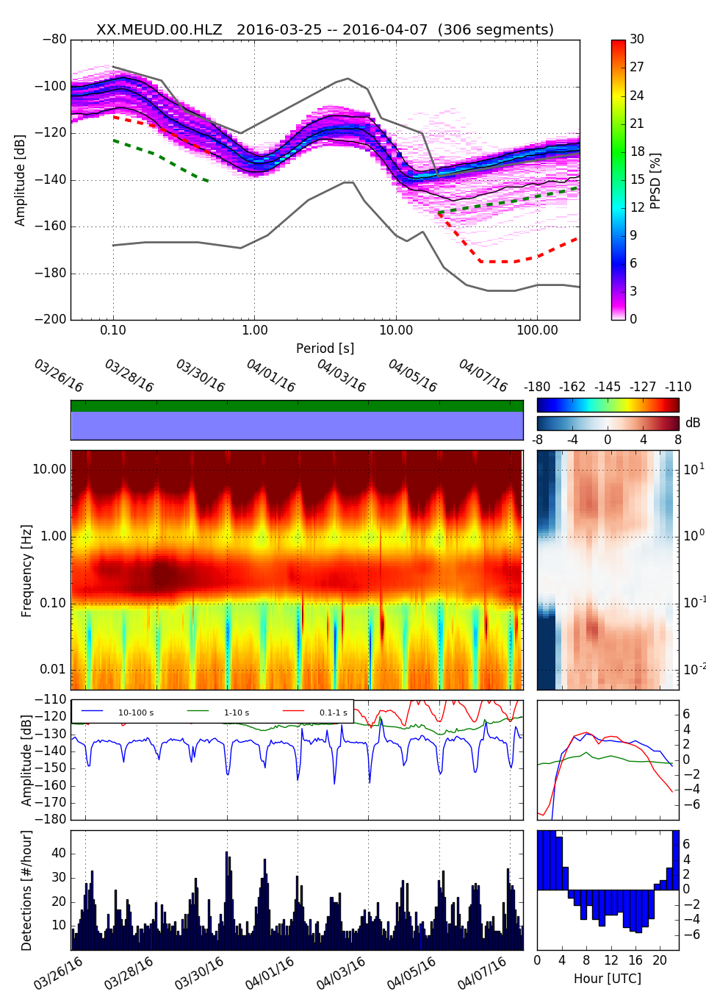

# clb-noise-analysis

Requirements:
+ OBSPY 1.0.1

1) Each station to be analysed needs to be in the station_dictionnary.py file. Just copy-paste the example and modify
- network
- locid
- channels to be analysed
- dataless_file
- path_data of the SDS structure where data is. Just modify the begining of the path and keep the end (/%year...) 

2) Daily data files needs to be in a SDS structure. If you don't have it already, you can use extract2sds.py to create it. This programm can at the same time change the station name, the locid, the network if the files. 
Ex:
``` code
./extract2sds.py -f "Example/Raw_Data/VINC/*" -s VINC -n XX -l 00 -o Example/SDS/
````
For each station you need a dataless file which could be created with PDCC (https://ds.iris.edu/ds/nodes/dmc/software/downloads/pdcc)

3) To analyse the data:
``` code
./qc.py -s G.OBP.00
````
If the station does not have a locid you must use quotes:
``` code
./qc.py -s "G.OBP."
````

Example:
You can download some files to test:
``` code
wget http://www.ipgp.fr/~bonaime/Example.zip
unzip Example.zip


./qc.py -s G.OBP.00
```


